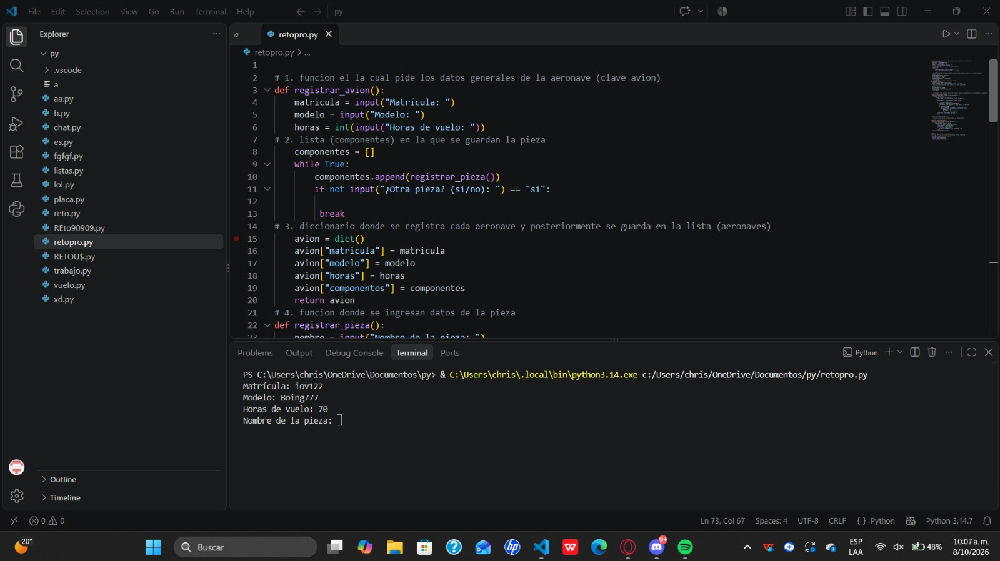
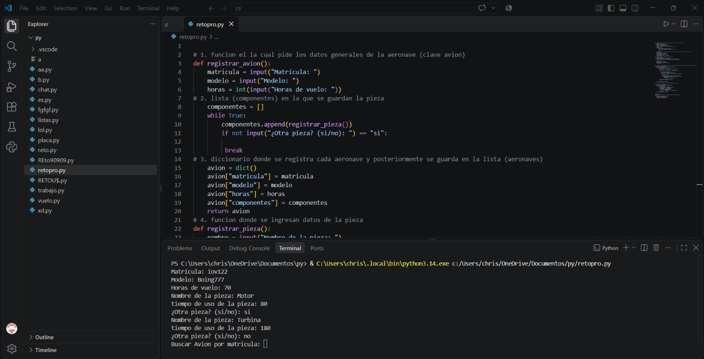
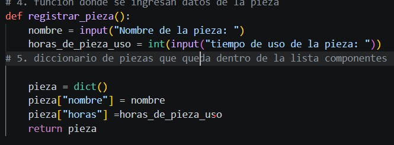
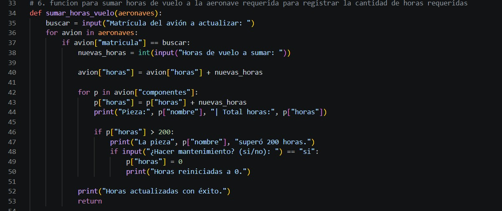
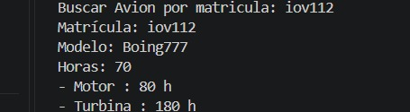
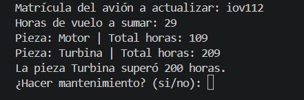
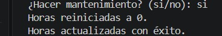
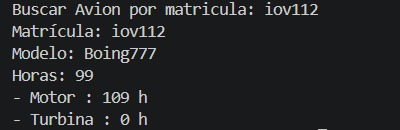
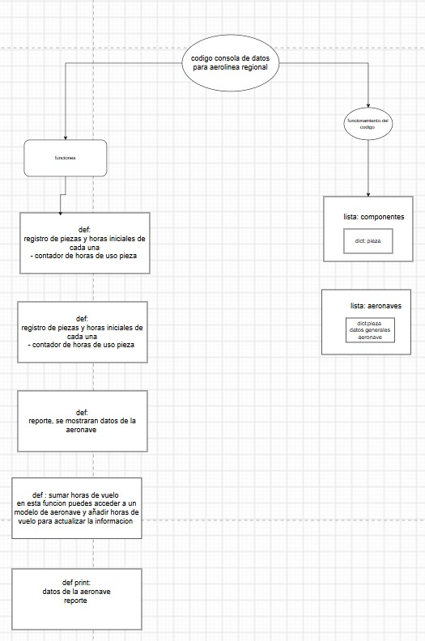

## Reto

# **Reto de Programación: Gestión de Mantenimiento de Flota Aeronáutica ✈️**
# en este archivo se muestra las pruebas del funcionamiento del codigo.

# registrar nuevo avion:

# registrar componente:

# agregar horas de uso:

## reporte:

# sin alerta

# agregar horas de vuelo

# con alerta

# reiniciar horas de uso del componente :

# auto evaluación: de acuerdo a los comentarios del profe y nuestro análisis consideramos que nuestra nota debe ser de 4 ya que hubo uso leve de ia para completar el código y evitar fallos durante el desarrollo del trbajo, tambien por que nuestro diagrama que estaba simplificado y falto mas abundancia sobre algunos detalles, por ultimo la exposicion fue clara y se demostro el conocimiento sobre el codigo.
# diagrama del funcionamiento del codigo

